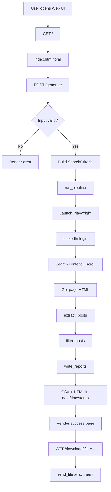
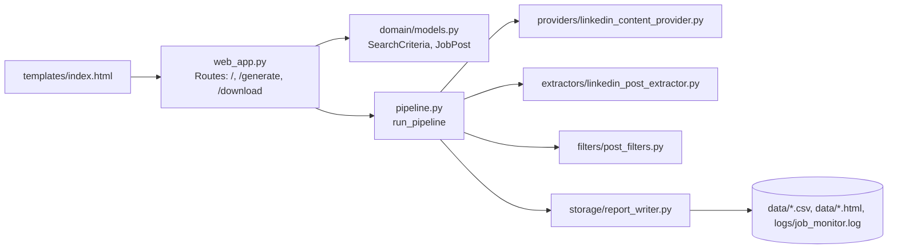
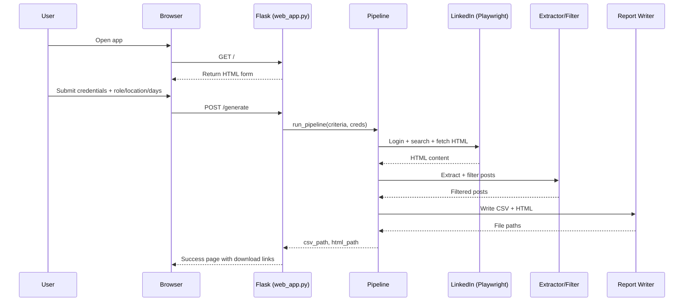

# LinkedIn Job Monitor Architecture

## Overview

This app automates LinkedIn content search for job-related posts and generates downloadable reports.

- Input: LinkedIn credentials + role/location/days
- Processing: login, fetch HTML, extract posts, filter matches
- Output: timestamped CSV and HTML reports

## 1) End-to-End Flow

## 2) Component View

## 3) Runtime Sequence

## 4) Scope Notes

- Current source is LinkedIn content posts search (not LinkedIn Jobs listings API).
- Credentials from the form are used per request and not intentionally persisted by app code.
- Reports are generated with timestamps for each run.
